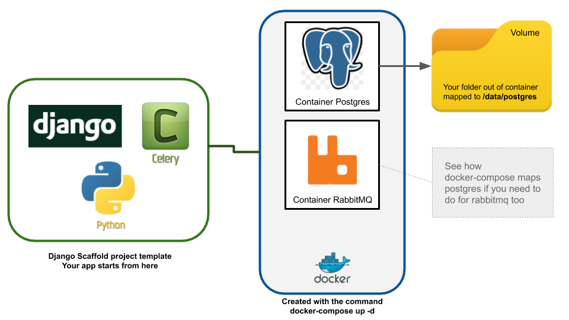
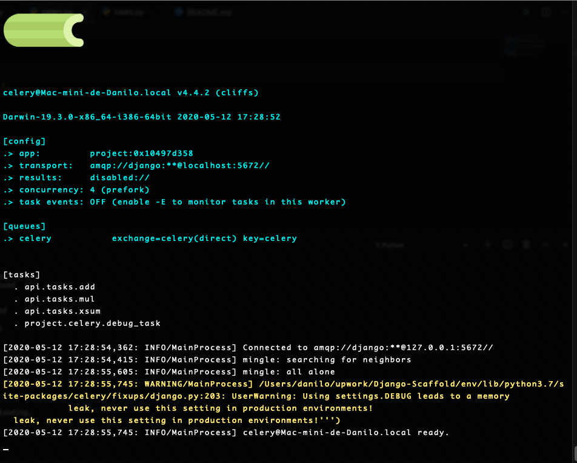

## Template Architecture
The template consists in one django project with celery and a docker-compose file to create one postgres and one rabbitmq broker container like show the picture below:


# Steps to configure and run this project

1. Clone repository: git clone https://github.com/tkwon/Django-Scaffold.git
2. Install virtualenv. `pip install virtualenv`
3. Create virtualenv. `python3 -m venv myenv`
4. Start your virtualenv. `.\myenv\scripts/activate` (windows) `source myenv/bin/activate` (linux)
5. Install pip-tools by `pip install pip-tools`
6. Install requirements. 
```
cd requirements  
pip-sync local.txt
```
7. Cd into `project/project/settings/` and copy the `local_settings_template.py` file into your own `local_settings.py`  
Fill in the information according to the current install requirements.  
8. Create your database
```
cd project/
python manage.py migrate
python manage.py createsuperuser
```
9. Done! Run the development server
`python manage.py runserver 0.0.0.0:8000`
10. Open your browser and navigate to http://localhost:8000

# API

The `api` app currently holds a basic setup for Django Rest Framework-based endpoints for users. In the API App
the endpoints can be expanded by creating additional view files with Viewsets for upcoming models. Docs for the API endpoints can be accessed at http://localhost:8000/api/v1/docs

### The celery config
* Celery is an asynchronous task queue/job queue based on distributed message passing. It is focused on real-time operation, but supports scheduling as well.
The execution units, called tasks, are executed concurrently on a single or more worker servers using multiprocessing, Eventlet, or gevent. Tasks can execute asynchronously (in the background) or synchronously (wait until ready). To see more informations, visit: https://docs.celeryproject.org/en/latest/django/index.html
* The basic config for celery is in the template. the file tasks.py has examples.
* To see if the celery is running, run you local server with `python manage.py runserver`, open another terminal, activate the same virtualenv and run celery `-A proj worker -l info` and you will see some like that:


# Deploy With CircleCI

You need add the env vars in circleci project settings on Environment Variables menu to add sensitive data
You need add your private key in SSH Keys -> Additional SSH Keys to enable ssh commands in run steps of the config.yml
To create a status badge for a private project you will need to create an api token specifically scoped to “status” and include that token in the url string of your badge. Consider the following markdown image badge snippet against the original markdown example above; it has a url parameter for a token added.

```[](<LINK>)```

To create a status api token, go to your project’s settings > API Permissions and create a token scoped to Status.

VCS -> gh (github)
Example: https://circleci.com/gh/tkwon/openacts2.svg?style=svg&circle-token=XXXX

And this is a badge for especific branch:
https://circleci.com/gh/tkwon/openacts2/tree/master.svg?style=svg&circle-token=XXXX

# Learn More

### The docker compose file:
* A container is a standard unit of software that packages up code and all its dependencies so the application runs quickly and reliably from one computing environment to another. On this template, we using containers to build a postgres and rabbitmq broker to help the developers to code with flexibility, security and isolate environments. To see more about docker and containers please visit: https://www.docker.com/resources/what-container.
* The docker compose file is on the root (docker-compose.yml) this file describe how the conteiners will up and yours settings. To see more about docker-compose please visit: https://docs.docker.com/compose/. Docker Compose installs automatically with Docker Desktop.
* Volume is a critical concept about data persistence when conteiners down, consider visit to get the basic info: https://docs.docker.com/storage/volumes/
* Step 1 - Create a path where your volumes will mapped (in the docker-compose.yml we setting a default path but you can choose another path)
* Step 2 - Install Docker desktop following the instructions: https://www.docker.com/products/docker-desktop
* Step 3 - Run the docker app, go to the project root (where docker-compose.yml is) and run the command: 
`docker-compose up -d`
* Step 4 - Run `docker ps` to check if the conteiners are running
* Ps. You can edit the docker compose with your env vars if you need
